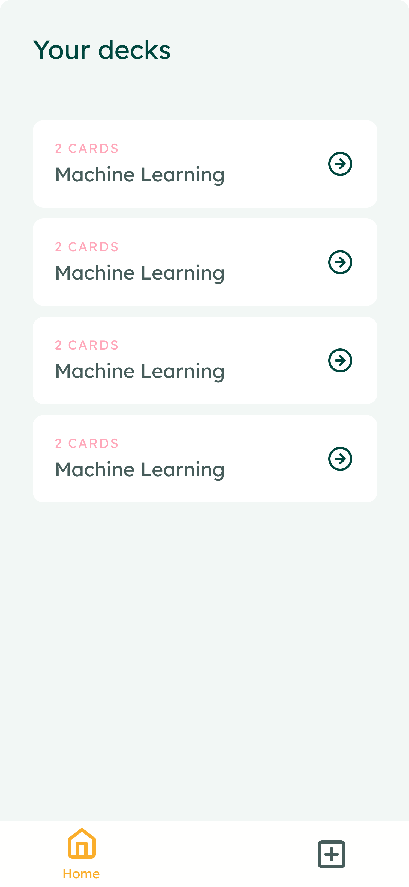
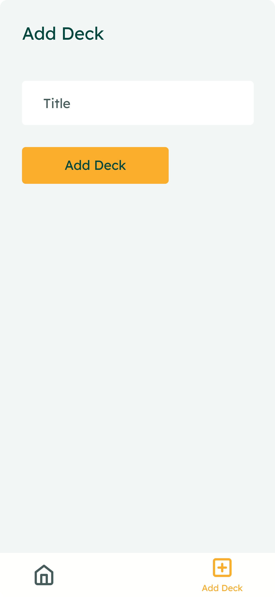
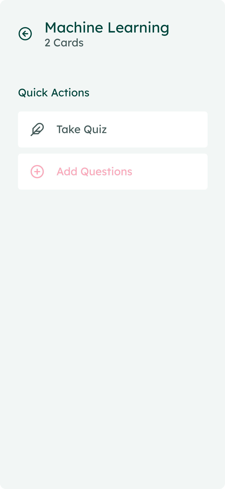

# Mobile Flashcards

The mobile flashcards is an app that lets you remember things that you often forgot by just asking questions and answers.

## Installation

1. To Start with download node on your pc from its official site.
2. Install the dependencies

```
    npm install
```

3. Install `expo-cli` using node

```
    npm i -g expo-cli
```

4. Before running the app run this command to link the font

```
    yarn react-native link
```

4. Run the app

```
    expo start
```

5. See live in your local machine [here](http://localhost:19002/).

## Screenshots

|                           |                           |                           |                           |
| ------------------------- | ------------------------- | ------------------------- | ------------------------- |
|  |  |  |  |
